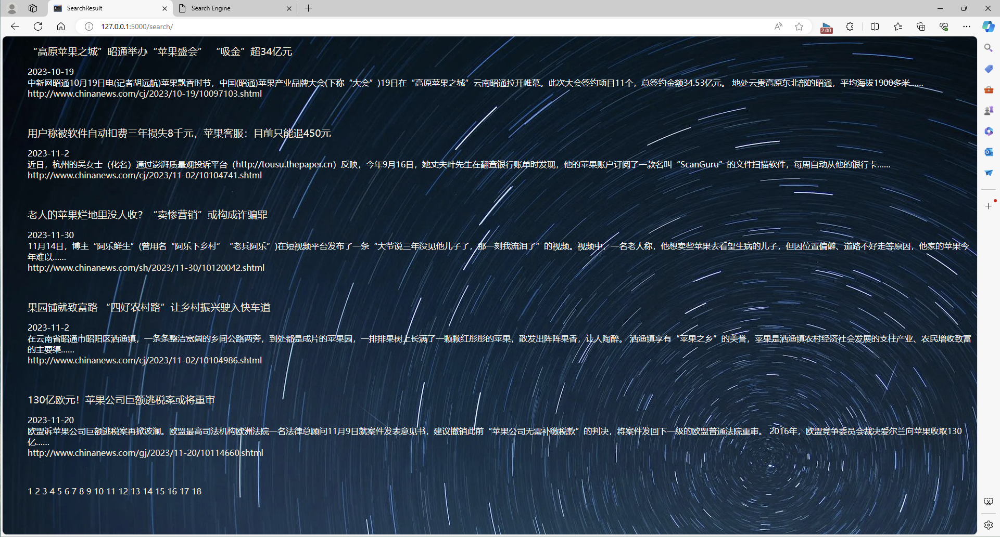

# 新闻搜索引擎
此项目主要包含爬虫、搜索、检索、拼音处理等模块。
```angular2html
│  indexTable.py
│  list.txt
│  main.py
│  search_engine.py
│  Selected_module.py
│  setup.py
│  spider.py
│  switch.py
│  
├─templates
       background.jpeg
       next.html
       page.html
       result.html 
       search.html
    

```
简介：</br>
爬虫模块会在网站上爬取指定数量的网页，然后提取网页内容并做存储为后续的数据检索做准备。</br>
检索模块会去做一些计算，比如网页重要性、TF-idf、BM25得分等，准备为搜索模块服务。</br>
搜索模块会处理用户输入的搜索词，比如识别拼音、分词等，然后调用检索模块去查找，最终将数据组织好后展示出来。(基于BM25得分排序)</br>

## 效果展示




## 待完善内容
- 添加其他可能影响结果的参数(eg.个人爱好，浏览器位置信息等)
- 采用多因素的网页排名系统 
- 通过机器学习的方法对结果排名
- 智能搜索（eg. 支持全英文搜索，搜索词纠错，自动补全等）
- 更准确的文档摘要

## How to build
- 运行爬虫模块，爬取网页
- 运行setup模块，构建倒排索引表
- 运行主函数即可
